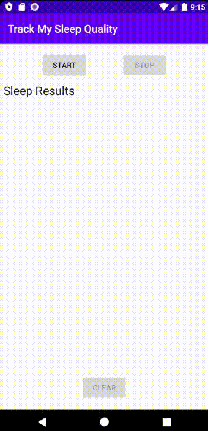
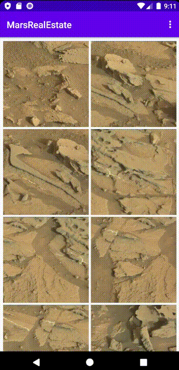
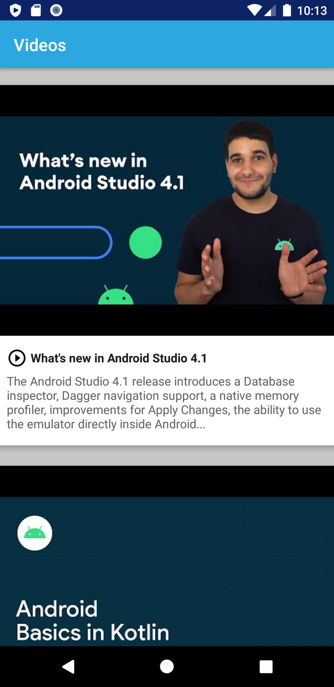
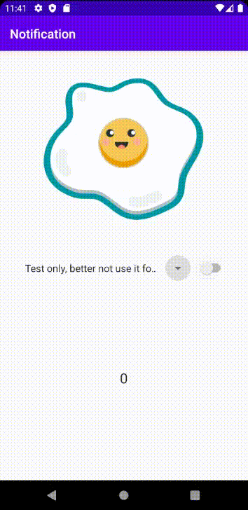
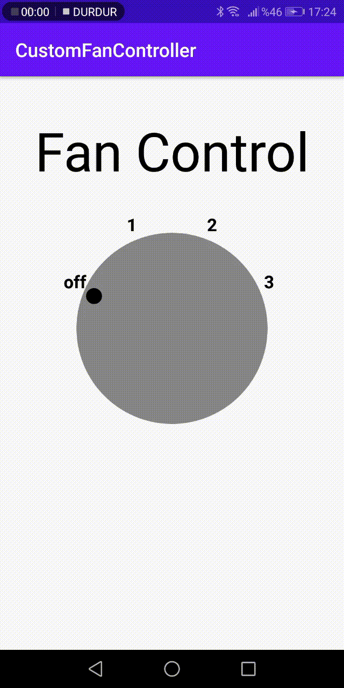
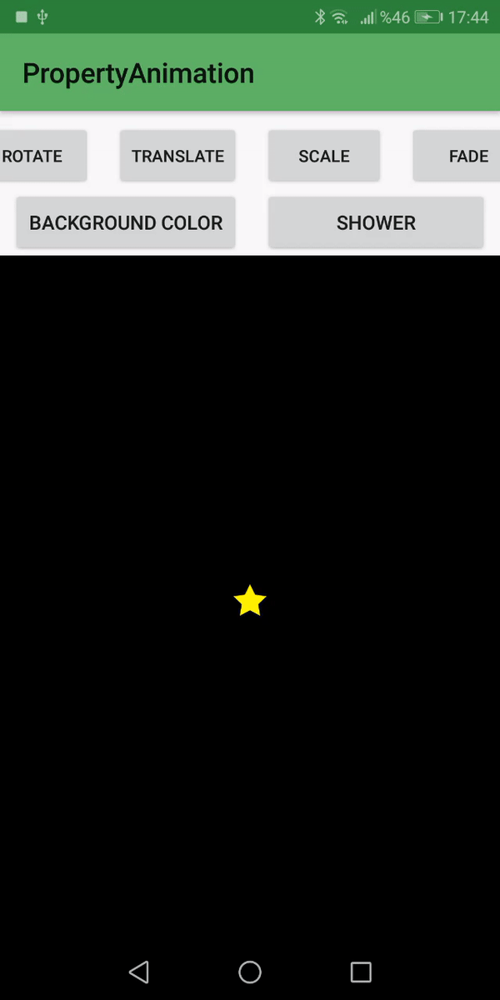
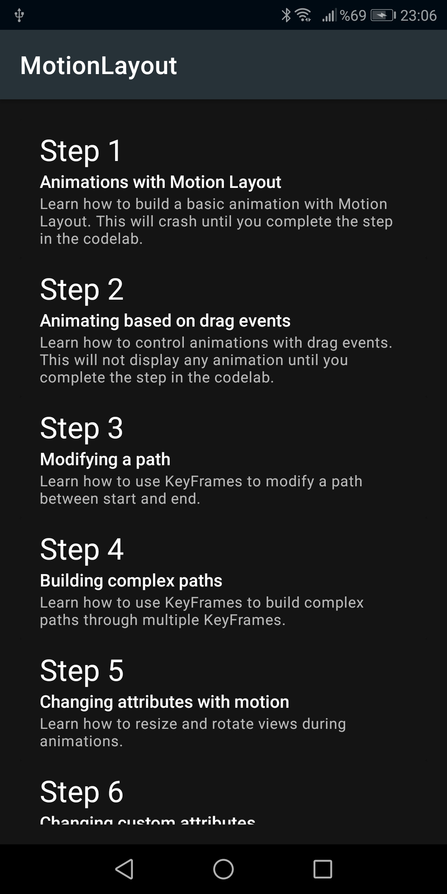

### In this repo, I will share my basic android projects that I made in the [Udacity Kotlin Developer Nanodegree Program.](https://www.udacity.com/course/android-kotlin-developer-nanodegree--nd940)

## ➡️ Course 1: Developing Android Apps with Kotlin - Part 1
### Project 1 -> [About Me App](https://github.com/edaersu/Udacity-Kotlin-Developer-Nanodegree-Projects/tree/master/course1_projects/AboutMe)
  
### Project 2 -> [Android Trivia App](https://github.com/edaersu/Udacity-Kotlin-Developer-Nanodegree-Projects/tree/master/course1_projects/AndroidTrivia)
  
### Project 3 -> [Dessert Pusher App](https://github.com/edaersu/Udacity-Kotlin-Developer-Nanodegree-Projects/tree/master/course1_projects/DessertPusher)
  
### Project 4 -> [Guess the Word App](https://github.com/edaersu/Udacity-Kotlin-Developer-Nanodegree-Projects/tree/master/course1_projects/GuessTheWord)
  

### ✓ Course Completion Project-> [Shoe Store App](https://github.com/edaersu/Udacity-Shoe-Store-Inventory-App)

## ➡️ Course 2: Developing Android Apps with Kotlin - Part 2
### Project 1 -> [Sleep Tricker](https://github.com/edaersu/Udacity-Kotlin-Developer-Nanodegree-Projects/tree/master/course2_projects/SleepApp)
  
### Project 2 -> [Mars Real Estate](https://github.com/edaersu/Udacity-Kotlin-Developer-Nanodegree-Projects/tree/master/course2_projects/MarsRealEstate)
  
### Project 3 -> [Video App](https://github.com/edaersu/Udacity-Kotlin-Developer-Nanodegree-Projects/tree/master/course2_projects/Videos)
  
### ✓ Course Completion Project-> [Asteroid Radar App](https://github.com/edaersu/Udacity-Asteroid-Radar-App)

## ➡️ Course 3: Advanced Android Apps with Kotlin - Part 1
### Project 1 -> [Notification](https://github.com/edaersu/Udacity-Kotlin-Developer-Nanodegree-Projects/tree/master/course3_projects/Notification)
  
### Project 2 -> [Custom Fan Controller](https://github.com/edaersu/Udacity-Kotlin-Developer-Nanodegree-Projects/tree/master/course3_projects/CustomFanController)
  
### Project 3 -> [Property Animation](https://github.com/edaersu/Udacity-Kotlin-Developer-Nanodegree-Projects/tree/master/course3_projects/PropertyAnimation)
  
### Project 3 -> [Motion Layout](https://github.com/edaersu/Udacity-Kotlin-Developer-Nanodegree-Projects/tree/master/course3_projects/MotionLayout)
  
### ✓ Course Completion Project-> [Load App](https://github.com/edaersu/Udacity-LoadApp)

### .
### .
### .
